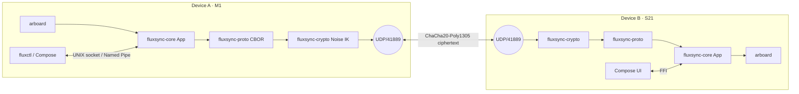

<!-- markdownlint-disable -->
```
   __  _              ____
  / _|| | _   _ __  __/ ___| _   _  _ __    ___
 | |_ | || | | |\ \/ /\___ \| | | || '_ \  / __|
 |  _|| || |_| | >  <  ___) | |_| || | | || (__
 |_|  |_| \__,_|/_/\_\|____/ \__, ||_| |_| \___|
                             |___/
```

**Universal clipboard. Local-first. Peer-to-peer. End-to-end encrypted.**
One daemon, four operating systems, zero servers.

---

## ⚡ v0.5.0 Release: Stabilization & Universal Sync
Official stable release. No more 40s latency. Instant P2P pairing.

### 📥 Download Pre-built Binaries (Easiest)
Don't want to build from source? Download the latest stable binaries directly:
- 📱 **Android**: [**Download fluxsync.apk**](https://github.com/flowerpower584/fluxsync/raw/main/fluxsync.apk)
- 💻 **macOS**: [**Download fluxsync.dmg**](https://github.com/flowerpower584/fluxsync/raw/main/fluxsync.dmg)

---

## Quickstart (v0.5.0)

### 1. Start the Engine
Run the daemon. This handles the background sync and encryption.
```sh
# macOS / Linux
./fluxsyncd --udp-bind 0.0.0.0 --ipc-path /tmp/flux.sock

# Windows
# fluxsyncd.exe --udp-bind 0.0.0.0 --ipc-path \\.\pipe\flux
```

### 2. Connect your Devices
Open the Android app or the macOS Tray icon. Scan the QR code to pair. **Your data never leaves your local network.**

### 3. Use the CLI (Optional)
```sh
./fluxctl --ipc-path /tmp/flux.sock status
./fluxctl --ipc-path /tmp/flux.sock push "Hello from Kaolack! 🇸🇳"
```

---

## 🛠️ Build from Source
If you prefer to build it yourself (requires Rust):
```sh
git clone https://github.com/flowerpower584/fluxsync && cd fluxsync
cargo build --release
```

## Architecture
(See the Mermaid diagram below for technical details)



## Why FluxSync vs the alternatives

| Need                                     | KDE Connect | Apple Universal Clipboard | syncthing | **FluxSync** |
|------------------------------------------|:-----------:|:-------------------------:|:---------:|:------------:|
| Works across macOS / Win / Linux / Android |   yes       |          no (Apple-only)  |   yes     |   **yes**    |
| End-to-end encrypted by default          |   yes       |          yes              |   yes     |   **yes**    |
| Zero servers / zero account              |   yes       |          no               |   yes     |   **yes**    |
| Designed for clipboard (not file sync)   |   yes       |          yes              |   no      |   **yes**    |
| Battery-aware auto-pause                 |   no        |          partial          |   no      |   **yes**    |
| One Rust daemon, no GUI dep              |   no        |          —                |   yes     |   **yes**    |
| Open source, MIT                         |   yes (GPL) |          no               |   yes (MPL) | **yes**     |

---
Crafted in Kaolack, Senegal 🇸🇳
