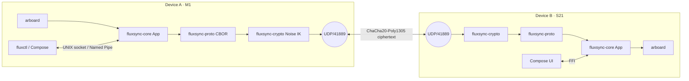

<!-- markdownlint-disable -->
```
   __  _              ____
  / _|| | _   _ __  __/ ___| _   _  _ __    ___
 | |_ | || | | |\ \/ /\___ \| | | || '_ \  / __|
 |  _|| || |_| | >  <  ___) | |_| || | | || (__
 |_|  |_| \__,_|/_/\_\|____/ \__, ||_| |_| \___|
                             |___/
```

[](https://github.com/flowerpower584/fluxsync/actions/workflows/ci.yml)
[](#license)
[](https://www.rust-lang.org)
[](https://github.com/flowerpower584/fluxsync/releases)
[](#install)

**Universal clipboard. Local-first. Peer-to-peer. End-to-end encrypted.**
One Rust daemon, dedicated apps for macOS + Android, zero servers.

> **Platform status (v0.5.1):** macOS tray app (universal — Apple Silicon + Intel) + Android app are the two first-class clients. The daemon + CLI also build cleanly on Linux (cross-compile to `x86_64-unknown-linux-musl` is green) so headless Linux use is supported. Windows daemon/CLI is not tested yet. No GUI on Linux/Windows — contributions welcome.

---

## ⚡ v0.5.1 Release: Terminal Polish + Universal macOS Binary
Universal macOS DMG (Apple Silicon + Intel). Styled `fluxctl` terminal output. Linux headless cross-compile green. Daemon version now tied to `CARGO_PKG_VERSION` automatically.

---

## Install

### 📱 Android
1. Download [**fluxsync.apk**](https://github.com/flowerpower584/fluxsync/raw/main/fluxsync.apk).
2. On the device, allow installs from the browser/Files app (Settings → Apps → Special access → Install unknown apps).
3. Open the APK to install. On first launch, grant the **camera** permission (used to scan the pairing QR) and **local network** access.

### 💻 macOS (Apple Silicon + Intel) — recommended

> **Heads up — Gatekeeper.** The build is **unsigned** (no Apple Developer ID — that subscription costs $99/year and isn't funded yet). Running it is safe but macOS will block the first launch with a *"FluxSync.app cannot be opened because Apple cannot check it for malicious software"* dialog. **Run the `xattr` command in step 3 BEFORE you double‑click the app** and you'll never see that dialog. Without it, you'll have to detour through System Settings → Privacy & Security to approve the app.

The DMG is a universal binary (`x86_64 + arm64` lipo'd together) — same file works on Intel Macs and Apple Silicon (M1/M2/M3).

1. Download [**FluxSync_0.5.1_universal.dmg**](https://github.com/flowerpower584/fluxsync/releases/download/v0.5.1/FluxSync_0.5.1_universal.dmg) (~8 MB).
2. Open the `.dmg` and drag **FluxSync.app** into `/Applications`. (You can eject the disk image now.)
3. **Open Terminal** and run this once — it strips the Safari quarantine flag so Gatekeeper lets the app start:
   ```sh
   xattr -dr com.apple.quarantine /Applications/FluxSync.app
   ```
   (If you already double-clicked the app and got the warning dialog, click **Cancel**, run the command above, then launch again.)
4. Launch **FluxSync** from Launchpad / Spotlight / `/Applications`. A tray icon appears in the menu bar (top-right).
5. macOS will prompt for **Local Network** access — approve it. This is required for mDNS peer discovery on UDP/41889; without it the app cannot find your phone.

**Stuck on macOS Sequoia (15+)?** Apple removed the right-click → Open shortcut. The `xattr` step above is now the easiest unblock. The other route is *System Settings → Privacy & Security → scroll to the bottom → "Open Anyway"* after the warning dialog, then click *"Open"* on the second confirmation.

### 🍺 Homebrew (macOS — terminal users)
A second-class option for people who already live in the terminal. Builds the daemon + CLI from source (~1–2 min on Apple Silicon, pulls Rust as a build dep). **No tray icon, no QR popup** — pair via `fluxctl pair show-qr` (renders the QR as Unicode in your terminal) and scan from the phone. Linuxbrew may work too — same formula — but isn't tested.
```sh
brew tap flowerpower584/fluxsync
brew install fluxsync
brew services start fluxsync   # auto-start daemon at login
fluxctl status                 # smoke-test
```
The tap lives at [`flowerpower584/homebrew-fluxsync`](https://github.com/flowerpower584/homebrew-fluxsync). **Don't run brew + the `.dmg` together** — both ship a daemon and they'll fight over UDP 41889 and `~/.fluxsync/sock`. Pick one path per machine.

### 🐧 Linux (terminal — headless)
The daemon and CLI cross-compile cleanly to Linux (`x86_64-unknown-linux-musl` checked from this machine). No tray app yet, so this is a CLI / systemd-unit setup — fine for servers and power-users. Two ways to install:

```sh
# Option A: cargo install (any distro with rustup)
cargo install --git https://github.com/flowerpower584/fluxsync \
              --tag v0.5.1 fluxsyncd fluxctl

# Option B: clone and build (lets you keep up with HEAD)
git clone https://github.com/flowerpower584/fluxsync.git
cd fluxsync
cargo build --release
# binaries: ./target/release/{fluxsyncd,fluxctl}
```

Auto-start on login via a per-user systemd unit at `~/.config/systemd/user/fluxsync.service`:
```ini
[Unit]
Description=FluxSync clipboard daemon
After=graphical-session.target

[Service]
ExecStart=%h/.cargo/bin/fluxsyncd
Restart=on-failure

[Install]
WantedBy=default.target
```
Then: `systemctl --user enable --now fluxsync.service`.

> **Linux clipboard caveat.** The daemon uses [`arboard`](https://crates.io/crates/arboard) which needs an X11 or Wayland session. On a fully headless box (no display at all) the clipboard watcher will fail to start — the daemon still runs and is reachable for `fluxctl push`, but you won't sync the system clipboard. Most desktop Linux setups are fine.

### 🛠️ Build from source (any platform)
Requires Rust ≥ 1.75 (`rustup` recommended).
```sh
git clone https://github.com/flowerpower584/fluxsync.git
cd fluxsync
cargo build --release
# binaries land at ./target/release/fluxsyncd  and  ./target/release/fluxctl
```

---

## Quickstart (v0.5.1)

### 1. Run the daemon
The macOS tray app and the Android app start the daemon for you — skip to step 2.

For the Homebrew install: `brew services start fluxsync` (already covered above).

If you built from source, run it manually (defaults: `~/.fluxsync/sock` IPC, UDP `0.0.0.0:41889`, identity persisted to `~/.fluxsync/identity.bin`):
```sh
./target/release/fluxsyncd
```

### 2. Pair your devices
Open the Android app or click the macOS tray icon → **Pair**. Show the QR on one device and scan it from the other. **Your data never leaves your local network.**

### 3. Use the CLI (optional)
The CLI talks to the daemon via the local IPC socket — useful for scripting headless setups. If you installed via Homebrew, drop the `./target/release/` prefix (binaries are on `$PATH`).
```sh
fluxctl status
fluxctl push "Hello from Kaolack! 🇸🇳"
fluxctl pair show-qr   # render this device's pair QR in the terminal
```

## Architecture
(See the Mermaid diagram below for technical details)



## Why FluxSync vs the alternatives

| Need                                     | KDE Connect | Apple Universal Clipboard | syncthing | **FluxSync** |
|------------------------------------------|:-----------:|:-------------------------:|:---------:|:------------:|
| Works across macOS + Android (apps shipped) |   partial (Linux+Android focus) |          macOS+iOS only  |   yes (file sync, not clipboard) |   **yes**    |
| End-to-end encrypted by default          |   yes       |          yes              |   yes     |   **yes**    |
| Zero servers / zero account              |   yes       |          no               |   yes     |   **yes**    |
| Designed for clipboard (not file sync)   |   yes       |          yes              |   no      |   **yes**    |
| Battery-aware auto-pause                 |   no        |          partial          |   no      |   **yes**    |
| One Rust daemon, no GUI dep              |   no        |          —                |   yes     |   **yes**    |
| Open source, permissive                  |   yes (GPL) |          no               |   yes (MPL) | **yes (MIT OR Apache-2.0)**     |

## License

FluxSync is dual-licensed under either of:

- [MIT License](LICENSE-MIT)
- [Apache License, Version 2.0](LICENSE-APACHE)

at your option. This is the standard Rust ecosystem dual-license — pick whichever fits your downstream project. Apache 2.0 adds an explicit patent grant; MIT keeps things short and GPL-compatible.

---
Crafted in Kaolack, Senegal 🇸🇳
