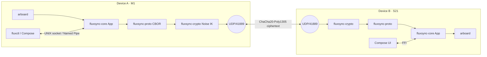

<!-- markdownlint-disable -->
```
   __  _              ____
  / _|| | _   _ __  __/ ___| _   _  _ __    ___
 | |_ | || | | |\ \/ /\___ \| | | || '_ \  / __|
 |  _|| || |_| | >  <  ___) | |_| || | | || (__
 |_|  |_| \__,_|/_/\_\|____/ \__, ||_| |_| \___|
                             |___/
```

[](https://github.com/flowerpower584/fluxsync/actions/workflows/ci.yml)
[](#license)
[](https://www.rust-lang.org)
[](https://github.com/flowerpower584/fluxsync/releases)
[](#install)

**Universal clipboard. Local-first. Peer-to-peer. End-to-end encrypted.**
One Rust daemon, dedicated apps for macOS + Android, zero servers.

> **Platform status (v0.5.2):** Android app is the first-class GUI client. macOS ships a menu-bar tray app (Tauri v2) built from source — no signed DMG until an Apple Dev ID is funded. The daemon + CLI also build cleanly on Linux (cross-compile to `x86_64-unknown-linux-musl` is green) so headless Linux use is supported. The daemon + CLI carry a `#[cfg(windows)]` Named Pipe IPC path; the Windows menu-bar app is not built yet. No GUI on Linux/Windows — contributions welcome.

See [CHANGELOG.md](CHANGELOG.md) for the per-release history.

---

## Install

### 📱 Android
1. Download [**fluxsync-v0.5.2.apk**](https://github.com/flowerpower584/fluxsync/releases/download/v0.5.2/fluxsync-v0.5.2.apk) (~25 MB).
2. On the device, allow installs from the browser/Files app (Settings → Apps → Special access → Install unknown apps).
3. Open the APK to install. On first launch, grant the **camera** permission (used to scan the pairing QR) and **local network** access.

### 🍎 macOS — menu-bar app (build from source)
No prebuilt DMG yet (no Apple Developer ID — $99/year, not in the budget). Build the Tauri v2 tray app yourself — it's a local build, no signing required. Needs Rust (`rustup`) and Node.js.

```sh
git clone https://github.com/flowerpower584/fluxsync.git
cd fluxsync/apps/macos-tray
npm install                    # installs the Tauri CLI
npm run tauri dev              # run with hot-reload, or:
npm run tauri build            # → src-tauri/target/release/bundle/macos/FluxSync.app
```

The tray app gives you the menu-bar icon, the master toggle, the peer + battery card, and the QR pairing popup. Want a signed `.app` shipped on releases? Sponsor the Apple Dev ID.

### 🐧 Linux (terminal — headless)
The daemon and CLI cross-compile cleanly to Linux (`x86_64-unknown-linux-musl` checked from this machine). No tray app yet, so this is a CLI / systemd-unit setup — fine for servers and power-users. Two ways to install:

```sh
# Option A: cargo install (any distro with rustup)
cargo install --git https://github.com/flowerpower584/fluxsync \
              --tag v0.5.2 fluxsyncd fluxctl

# Option B: clone and build (lets you keep up with HEAD)
git clone https://github.com/flowerpower584/fluxsync.git
cd fluxsync
cargo build --release
# binaries: ./target/release/{fluxsyncd,fluxctl}
```

Auto-start on login via a per-user systemd unit at `~/.config/systemd/user/fluxsync.service`:
```ini
[Unit]
Description=FluxSync clipboard daemon
After=graphical-session.target

[Service]
ExecStart=%h/.cargo/bin/fluxsyncd
Restart=on-failure

[Install]
WantedBy=default.target
```
Then: `systemctl --user enable --now fluxsync.service`.

> **Linux clipboard caveat.** The daemon uses [`arboard`](https://crates.io/crates/arboard) which needs an X11 or Wayland session. On a fully headless box (no display at all) the clipboard watcher will fail to start — the daemon still runs and is reachable for `fluxctl push`, but you won't sync the system clipboard. Most desktop Linux setups are fine.

### 🛠️ Build from source (any platform)
Requires Rust ≥ 1.88 (`rustup` recommended).
```sh
git clone https://github.com/flowerpower584/fluxsync.git
cd fluxsync
cargo build --release
# binaries land at ./target/release/fluxsyncd  and  ./target/release/fluxctl
```

---

## Quickstart

### 1. Run the daemon
The Android app starts the daemon for itself — skip to step 2 if you're only using a phone. The macOS tray app also manages the daemon for you.

If you built the CLI from source, run it manually (defaults: `~/.fluxsync/sock` IPC, UDP `0.0.0.0:41889`, identity persisted to `~/.fluxsync/identity.bin`):
```sh
./target/release/fluxsyncd
```

### 2. Pair your devices
On macOS / Linux: `fluxctl pair show-qr` renders the QR in the terminal — scan it from the Android app. From the Android app, tap **Pair** and scan the QR shown by the other device. **Your data never leaves your local network.**

### 3. Use the CLI (optional)
The CLI talks to the daemon via the local IPC socket — useful for scripting headless setups. If you've put `./target/release/` on your `$PATH`, drop the prefix.
```sh
fluxctl status
fluxctl push "Hello from Kaolack! 🇸🇳"
fluxctl pair show-qr   # render this device's pair QR in the terminal
```

## Architecture



## Why FluxSync vs the alternatives

| Need                                     | KDE Connect | Apple Universal Clipboard | syncthing | **FluxSync** |
|------------------------------------------|:-----------:|:-------------------------:|:---------:|:------------:|
| Works across macOS + Android (apps shipped) |   partial (Linux+Android focus) |          macOS+iOS only  |   yes (file sync, not clipboard) |   **yes**    |
| End-to-end encrypted by default          |   yes       |          yes              |   yes     |   **yes**    |
| Zero servers / zero account              |   yes       |          no               |   yes     |   **yes**    |
| Designed for clipboard (not file sync)   |   yes       |          yes              |   no      |   **yes**    |
| Battery-aware auto-pause                 |   no        |          partial          |   no      |   **yes**    |
| One Rust daemon, no GUI dep              |   no        |          —                |   yes     |   **yes**    |
| Open source, permissive                  |   yes (GPL) |          no               |   yes (MPL) | **yes (MIT OR Apache-2.0)**     |

## License

FluxSync is dual-licensed under either of:

- [MIT License](LICENSE-MIT)
- [Apache License, Version 2.0](LICENSE-APACHE)

at your option. This is the standard Rust ecosystem dual-license — pick whichever fits your downstream project. Apache 2.0 adds an explicit patent grant; MIT keeps things short and GPL-compatible.

## 🔒 Security & Known Issues (v0.5.2)

- **End-to-End Encryption**: All traffic is encrypted using the **Noise IK** handshake (Curve25519, ChaCha20, Poly1305).
- **No Servers**: Peer discovery happens via mDNS (local network only).
- **Persistent Pairing**: Trusted peers are saved to `~/.fluxsync/peers.json` and reloaded on daemon start, so a pairing survives restarts.
- **Known Bugs**:
    - **Handshake Deadlock**: If a handshake packet is lost during pairing, sync can hang until a manual toggle. (Transport-frame loss after the handshake is handled as of v0.5.2.)
    - **Clipboard Ping-Pong**: Trailing spaces in text can still cause sync loops in some cases.
- **Roadmap (v0.6.0)**:
    - **Key Storage**: Secure OS Keychain integration (the long-term identity key currently lives in a `0600` file).
    - **Windows menu-bar app**: the daemon + CLI already speak Named Pipe IPC on Windows; a Tauri tray app for Windows is not built yet.

---
Crafted in Kaolack, Senegal 🇸🇳
