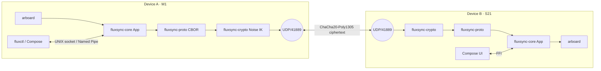

<!-- markdownlint-disable -->
```
   __  _              ____
  / _|| | _   _ __  __/ ___| _   _  _ __    ___
 | |_ | || | | |\ \/ /\___ \| | | || '_ \  / __|
 |  _|| || |_| | >  <  ___) | |_| || | | || (__
 |_|  |_| \__,_|/_/\_\|____/ \__, ||_| |_| \___|
                             |___/
```

**Universal clipboard. Local-first. Peer-to-peer. End-to-end encrypted.**
One daemon, four operating systems, zero servers.

---

## Quickstart

```sh
# 1. install
git clone https://github.com/dethie/fluxsync && cd fluxsync && cargo build --release

# 2. run the daemon (one terminal)
./target/release/fluxsyncd --ipc-path /tmp/flux.sock --udp-bind 127.0.0.1

# 3. drive it (another terminal)
./target/release/fluxctl --ipc-path /tmp/flux.sock --json status
./target/release/fluxctl --ipc-path /tmp/flux.sock --json push "https://kaolack.sn"
```

> v0.1 ships the daemon, the CLI, and the Android UniFFI shell. Real
> cross-device pairing (mDNS + QR) lands in v0.1.1 — see `CHANGELOG.md`.

## Architecture



## Why FluxSync vs the alternatives

| Need                                     | KDE Connect | Apple Universal Clipboard | syncthing | **FluxSync** |
|------------------------------------------|:-----------:|:-------------------------:|:---------:|:------------:|
| Works across macOS / Win / Linux / Android |   yes       |          no (Apple-only)  |   yes     |   **yes**    |
| End-to-end encrypted by default          |   yes       |          yes              |   yes     |   **yes**    |
| Zero servers / zero account              |   yes       |          no               |   yes     |   **yes**    |
| Designed for clipboard (not file sync)   |   yes       |          yes              |   no      |   **yes**    |
| Battery-aware auto-pause                 |   no        |          partial          |   no      |   **yes**    |
| One Rust daemon, no GUI dep              |   no        |          —                |   yes     |   **yes**    |
| Open source, MIT                         |   yes (GPL) |          no               |   yes (MPL) | **yes**     |

## Threat model (4 lines)

Every byte that leaves the device is sealed in a Noise IK ChaCha20-Poly1305 session keyed to a peer the user explicitly paired. There is no plaintext fallback, ever. A 6-word verbal fingerprint defeats LAN MITM at pair-time. Long-term identity keys live in the OS keychain, never on disk in clear. Full threat model: [`docs/SECURITY.md`](docs/SECURITY.md).

## License

MIT. See [`LICENSE`](LICENSE).

---
Crafted in Kaolack, Senegal 🇸🇳
