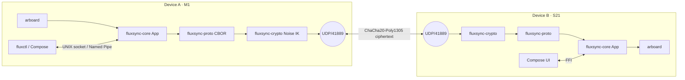

<!-- markdownlint-disable -->
```
   __  _              ____
  / _|| | _   _ __  __/ ___| _   _  _ __    ___
 | |_ | || | | |\ \/ /\___ \| | | || '_ \  / __|
 |  _|| || |_| | >  <  ___) | |_| || | | || (__
 |_|  |_| \__,_|/_/\_\|____/ \__, ||_| |_| \___|
                             |___/
```

**Universal clipboard. Local-first. Peer-to-peer. End-to-end encrypted.**
One daemon, four operating systems, zero servers.

---

## ⚡ v0.5.0 Release: Stabilization & Universal Sync
Official stable release. No more 40s latency. Instant P2P pairing.

---

## Install

### 📱 Android
1. Download [**fluxsync.apk**](https://github.com/flowerpower584/fluxsync/raw/main/fluxsync.apk).
2. On the device, allow installs from the browser/Files app (Settings → Apps → Special access → Install unknown apps).
3. Open the APK to install. On first launch, grant the **camera** permission (used to scan the pairing QR) and **local network** access.

### 💻 macOS (Apple Silicon)
1. Download [**fluxsync.dmg**](https://github.com/flowerpower584/fluxsync/raw/main/fluxsync.dmg).
2. Open the `.dmg` and drag **FluxSync.app** into `/Applications`.
3. The build is unsigned, so Gatekeeper will block the first launch. Either right‑click the app → **Open** → **Open** in the dialog, or remove the quarantine flag once:
   ```sh
   xattr -dr com.apple.quarantine /Applications/FluxSync.app
   ```
4. Launch FluxSync — a tray icon appears in the menu bar. Approve the macOS prompt for **Local Network** access (required for mDNS peer discovery on UDP/41889).

### 🛠️ Build from source
Requires Rust ≥ 1.75 (`rustup` recommended).
```sh
git clone https://github.com/flowerpower584/fluxsync.git
cd fluxsync
cargo build --release
# binaries land at ./target/release/fluxsyncd  and  ./target/release/fluxctl
```

---

## Quickstart (v0.5.0)

### 1. Run the daemon
The macOS tray app and the Android app start the daemon for you — skip to step 2.

If you built from source, run it manually (defaults: `~/.fluxsync/sock` IPC, UDP `0.0.0.0:41889`, identity persisted to `~/.fluxsync/identity.bin`):
```sh
./target/release/fluxsyncd
```

### 2. Pair your devices
Open the Android app or click the macOS tray icon → **Pair**. Show the QR on one device and scan it from the other. **Your data never leaves your local network.**

### 3. Use the CLI (optional)
The CLI talks to the daemon via the local IPC socket — useful for scripting or running the daemon headless on Linux.
```sh
./target/release/fluxctl status
./target/release/fluxctl push "Hello from Kaolack! 🇸🇳"
./target/release/fluxctl pair show-qr   # render this device's pair QR in the terminal
```

## Architecture
(See the Mermaid diagram below for technical details)



## Why FluxSync vs the alternatives

| Need                                     | KDE Connect | Apple Universal Clipboard | syncthing | **FluxSync** |
|------------------------------------------|:-----------:|:-------------------------:|:---------:|:------------:|
| Works across macOS / Win / Linux / Android |   yes       |          no (Apple-only)  |   yes     |   **yes**    |
| End-to-end encrypted by default          |   yes       |          yes              |   yes     |   **yes**    |
| Zero servers / zero account              |   yes       |          no               |   yes     |   **yes**    |
| Designed for clipboard (not file sync)   |   yes       |          yes              |   no      |   **yes**    |
| Battery-aware auto-pause                 |   no        |          partial          |   no      |   **yes**    |
| One Rust daemon, no GUI dep              |   no        |          —                |   yes     |   **yes**    |
| Open source, MIT                         |   yes (GPL) |          no               |   yes (MPL) | **yes**     |

---
Crafted in Kaolack, Senegal 🇸🇳
