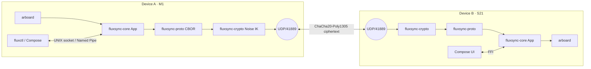

<!-- markdownlint-disable -->
```
   __  _              ____
  / _|| | _   _ __  __/ ___| _   _  _ __    ___
 | |_ | || | | |\ \/ /\___ \| | | || '_ \  / __|
 |  _|| || |_| | >  <  ___) | |_| || | | || (__
 |_|  |_| \__,_|/_/\_\|____/ \__, ||_| |_| \___|
                             |___/
```

[](https://github.com/flowerpower584/fluxsync/actions/workflows/ci.yml)
[](#license)
[](https://www.rust-lang.org)
[](https://github.com/flowerpower584/fluxsync/releases)
[](#install)

**Universal clipboard. Local-first. Peer-to-peer. End-to-end encrypted.**
One Rust daemon, dedicated apps for macOS, Windows, Linux + Android, zero servers.

> **Platform status (v0.6.1):** Android, macOS, Windows and Linux all ship a GUI. macOS = menu-bar / Dock app (Tauri v2, built from source — no signed DMG until an Apple Dev ID is funded). Windows = NSIS tray app (x64 + ARM64). Linux = full Tauri GUI (deb / AppImage) plus a native ksni `StatusNotifierItem` system-tray. Android is the first-class mobile client. The daemon + CLI also build cleanly everywhere for headless use.

See [CHANGELOG.md](CHANGELOG.md) for the per-release history.

---

## Install

Prebuilt apps for every platform are on the [**latest release**](https://github.com/flowerpower584/fluxsync/releases/latest). Desktop builds are **unsigned** (no Apple Developer ID / Windows code-signing cert yet), so you'll need to click through a first-run warning — see each section.

### 📱 Android
1. Download [**FluxSync-v0.6.1-arm64-v8a.apk**](https://github.com/flowerpower584/fluxsync/releases/download/v0.6.1/FluxSync-v0.6.1-arm64-v8a.apk) (~25 MB, arm64-v8a).
2. On the device, allow installs from the browser/Files app (Settings → Apps → Special access → Install unknown apps).
3. Open the APK to install. On first launch, grant the **camera** permission (used to scan the pairing QR) and **local network** access.

### 🍎 macOS — menu-bar app
Download the DMG for your chip: [`aarch64`](https://github.com/flowerpower584/fluxsync/releases/latest) (Apple Silicon) or [`x64`](https://github.com/flowerpower584/fluxsync/releases/latest) (Intel). It's **unsigned**, so on first launch right-click the app → **Open** (or run `xattr -dr com.apple.quarantine /Applications/FluxSync.app`). Prefer to build it yourself? Needs Rust (`rustup`) + Node.js:

```sh
git clone https://github.com/flowerpower584/fluxsync.git
cd fluxsync/apps/macos-tray
npm install                    # installs the Tauri CLI
npm run tauri dev              # run with hot-reload, or:
npm run tauri build            # → src-tauri/target/release/bundle/macos/FluxSync.app
```

The tray app gives you the menu-bar icon, the master toggle, the peer + battery card, and the QR pairing popup. Want a signed `.app`? Sponsor the Apple Dev ID.

### 🪟 Windows — tray app
Download the NSIS installer for your arch from the [latest release](https://github.com/flowerpower584/fluxsync/releases/latest): `FluxSync_0.6.1_x64-setup.exe` or `FluxSync_0.6.1_arm64-setup.exe`. It installs per-user and fetches the WebView2 runtime if missing. Unsigned, so SmartScreen shows **More info → Run anyway** on first launch.

### 🐧 Linux — GUI or headless
Download the [`AppImage`](https://github.com/flowerpower584/fluxsync/releases/latest) (portable, `chmod +x` then run) or the [`.deb`](https://github.com/flowerpower584/fluxsync/releases/latest) from the latest release — both ship the full Tauri GUI and a native ksni system-tray. For servers / power-users, the headless daemon + CLI build from source:

```sh
# Option A: cargo install (any distro with rustup)
cargo install --git https://github.com/flowerpower584/fluxsync \
              --tag v0.6.1 fluxsyncd fluxctl

# Option B: clone and build (lets you keep up with HEAD)
git clone https://github.com/flowerpower584/fluxsync.git
cd fluxsync
cargo build --release
# binaries: ./target/release/{fluxsyncd,fluxctl}
```

Auto-start on login via a per-user systemd unit at `~/.config/systemd/user/fluxsync.service`:
```ini
[Unit]
Description=FluxSync clipboard daemon
After=graphical-session.target

[Service]
ExecStart=%h/.cargo/bin/fluxsyncd
Restart=on-failure

[Install]
WantedBy=default.target
```
Then: `systemctl --user enable --now fluxsync.service`.

> **Linux clipboard caveat.** The daemon uses [`arboard`](https://crates.io/crates/arboard) which needs an X11 or Wayland session. On a fully headless box (no display at all) the clipboard watcher will fail to start — the daemon still runs and is reachable for `fluxctl push`, but you won't sync the system clipboard. Most desktop Linux setups are fine.

### 🛠️ Build from source (any platform)
Requires Rust ≥ 1.88 (`rustup` recommended).
```sh
git clone https://github.com/flowerpower584/fluxsync.git
cd fluxsync
cargo build --release
# binaries land at ./target/release/fluxsyncd  and  ./target/release/fluxctl
```

---

## Quickstart

### 1. Run the daemon
The Android app starts the daemon for itself — skip to step 2 if you're only using a phone. The macOS tray app also manages the daemon for you.

If you built the CLI from source, run it manually (defaults: `~/.fluxsync/sock` IPC, UDP `0.0.0.0:41889`, identity persisted to `~/.fluxsync/identity.bin`):
```sh
./target/release/fluxsyncd
```

### 2. Pair your devices
On macOS / Linux: `fluxctl pair show-qr` renders the QR in the terminal — scan it from the Android app. From the Android app, tap **Pair** and scan the QR shown by the other device. **Your data never leaves your local network.**

### 3. Use the CLI (optional)
The CLI talks to the daemon via the local IPC socket — useful for scripting headless setups. If you've put `./target/release/` on your `$PATH`, drop the prefix.
```sh
fluxctl status
fluxctl push "Hello from Kaolack! 🇸🇳"
fluxctl pair show-qr   # render this device's pair QR in the terminal
```

### 4. Sync across networks with Tailscale (optional)
FluxSync discovers peers on the **same LAN** via mDNS. To sync across different
networks (home ↔ office, laptop ↔ phone on cellular), put your devices on a
[Tailscale](https://tailscale.com) tailnet and pair by address — no LAN required.

FluxSync has **zero Tailscale dependency**: the daemon already listens on
`0.0.0.0`, so it's reachable on your tailnet IP the moment Tailscale is up.
Tailscale just provides a stable, encrypted `100.x.y.z` address; FluxSync routes
to it like any other IP. You can drop Tailscale anytime and LAN mode still works.

mDNS does **not** propagate over a tailnet, so auto-discovery won't find the
peer. FluxSync handles this automatically: when a tailnet interface is present,
the pair URI/QR carries **both** addresses — `a=<lan>,<tailnet>` — and the other
device tries each in order (LAN first, then tailnet). **The same QR works whether
the peer is on your LAN or only reachable over the tailnet** — nothing to toggle.

```sh
# pair show-qr / show now emit a multi-address URI when Tailscale is up,
# and print the detected tailnet address on a "tailnet" line:
fluxctl pair show          # uri: fluxsync://pair/<pubkey>?a=192.168.1.5:41889,100.92.14.7:41889&f=<words>
                           # tailnet: 100.92.14.7:41889

# On the other device, trust the peer from that single URI (works both ways):
fluxctl pair from-uri --uri "fluxsync://pair/<pubkey>?a=192.168.1.5:41889,100.92.14.7:41889&f=<words>" --name laptop
```

If you ever need to pin a specific address by hand, `fluxctl pair accept
--pubkey <b32> --name laptop --addr 100.92.14.7:41889` still works.

Verify the 6 safe-words match on both devices, exactly as on LAN. Everything
else — Noise IK encryption, SAS verification, clipboard sync — is unchanged.

## Architecture



## License

FluxSync is dual-licensed under either of:

- [MIT License](LICENSE-MIT)
- [Apache License, Version 2.0](LICENSE-APACHE)

at your option. This is the standard Rust ecosystem dual-license — pick whichever fits your downstream project. Apache 2.0 adds an explicit patent grant; MIT keeps things short and GPL-compatible.

## 🔒 Security & Known Issues (v0.6.1)

- **End-to-End Encryption**: All traffic is encrypted using the **Noise IK** handshake (Curve25519, ChaCha20, Poly1305).
- **No Servers**: Peer discovery happens via mDNS (local network only); mDNS-advertised identities are always re-verified against the Noise static key.
- **Verified pairing**: QR or 6-digit PIN, gated by a symmetric SAS verify-words check on both devices.
- **Persistent Pairing**: Trusted peers are saved to `~/.fluxsync/peers.json` and reloaded on daemon start, so a pairing survives restarts.
- **Key storage**: the long-term identity key lives in the **OS keychain** — macOS Keychain, Windows Credential Manager, Linux Secret Service. A legacy `identity.bin` is auto-migrated on first boot; set `FLUXSYNC_NO_KEYCHAIN=1` to fall back to a `0600` file (headless boxes with no keychain/dbus). Android uses app-private storage.
- **Known issues**:
    - **Clipboard images**: image sync works Mac → Android; some desktop ↔ desktop cases are rough (transparent images paste as white; copying an image *file* sends its path, not the bytes).
- **Roadmap**:
    - **Signed builds**: Apple Developer ID + Windows code-signing once funded (current desktop builds are unsigned).

---
Crafted in Kaolack, Senegal 🇸🇳
